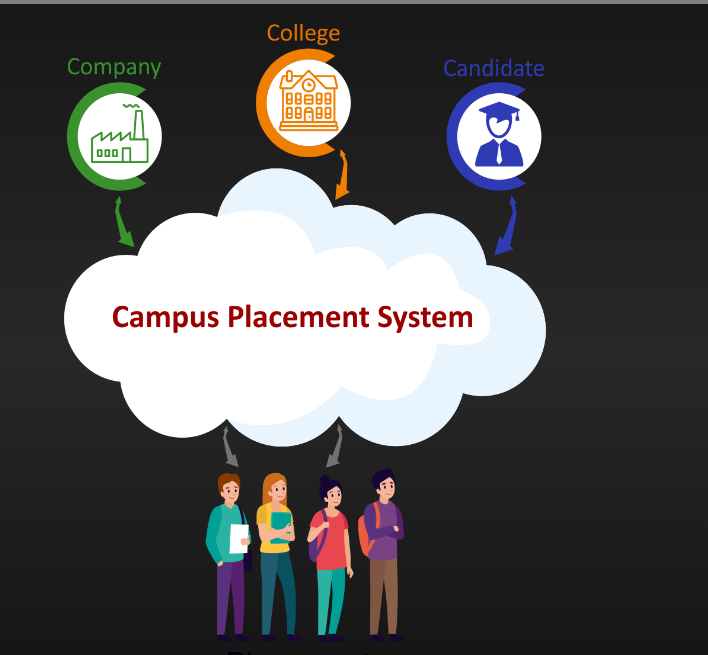

Project Name :Campus Placement Prediction

Dataset:  https://www.kaggle.com/code/shubham47/campus-placement-analysis/input

About Dataset:
specializationsl_no :- serial number
Gender:- gender identification M or F
ssc_p:- SSC percentage
ssc_b:- information about SSC board i.e. central board or state board. State board is with respect to a particular state.
hsc_p:- HSC percentage
hsc_b:- information about HSC board i.e. central board or state board. State board is with respect to a particular state.
hsc_s:- which branch completed the HSC? Commerce, science, and art
degree_p:- Degree percentage
degree_t:- which branch completed the degree? sci&tech and comm&mgmt
workex:- any work experience ‘YES’ or ‘NO’
etest_p:- test percentage
specialisation:- branch specialization i.e. Mkt&HR, Mky&Fin
mba_p:- MBA percentage
Status:- About placement, he/she placed or not placed.

Requirements:

pandas
scikit-learn
numpy
seaborn
ipykernel
Flask
matplotlib

mlflow==2.2.2
dvc

setup:

"creating env with python 3.8 version" 

 conda create --prefix ./env python=3.8 -y

 "activating the environment" 

 source activate ./env

"installing the dev requirements" 

 pip install -r requirements.txt
